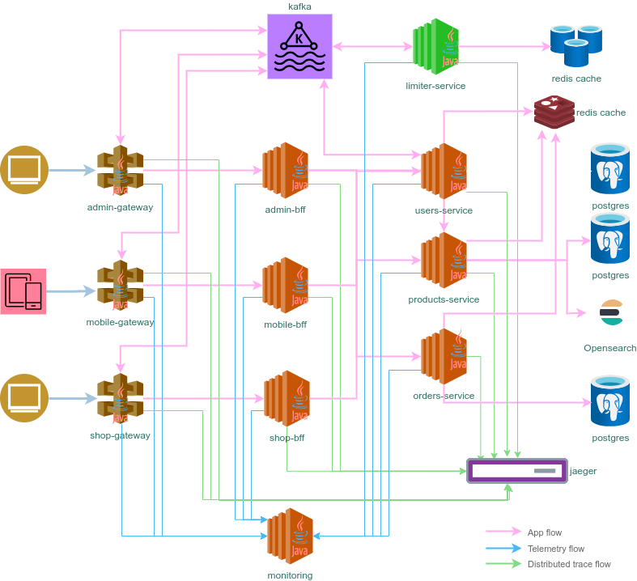

# Limiter service

[](https://github.com/sjexpos/ecomm-limiter/releases/latest)
[](https://github.com/sjexpos/ecomm-limiter/actions?workflow=CI)
[](https://codecov.io/gh/sjexpos/ecomm-limiter)
[](https://github.com/sjexpos/ecomm-limiter/issues)
[](https://github.com/sjexpos/ecomm-limiter/commits)



This microservice is responsible for ...


## Modules structure

This project has the following modules:

* **cache-lib** - cache library which implements redis lock using annotation @RedisLock and gzip serializer
* **model** - objects which are shared through topics
* **kafka-mps** - message proxy service to implement push model
* **processor** - component which decide if the user has reached the rate limit

## Framework

* [Spring Boot 3.3.2](https://spring.io/projects/spring-boot/)
* [Spring Cloud 2023.0.3](https://spring.io/projects/spring-cloud)
* [Spring Kafka 3.2.3](https://spring.io/projects/spring-kafka)
* [Openapi V3](https://swagger.io/specification/)

## Requirements

* [Java 21](https://openjdk.org/install/)
* [Maven 3.8.8+](https://maven.apache.org/download.cgi)
* [AWS Cli](https://aws.amazon.com/es/cli/)
* [Docker](https://www.docker.com/)

## Build

```bash
mvn clean && mvn install
```

## Run Tests
```bash
mvn clean && mvn tests
```

## Runtime requeriments

* **Redis** - it must be run on port 6379. None password.
* **Kafka** - it must be run on port 9092.

### Run application
```bash
./run.sh
```

## Check message on a Kafka topic

It's possible to jump into kafka server using ssh, or connect to the container if it is running in a docker container,
and the following command will allow you to see the message which are generated by this service on topic "users-entities-update-topic"

```bash
/bin/kafka-console-consumer --bootstrap-server localhost:9092 --from-beginning --topic users-entities-update-topic
```

